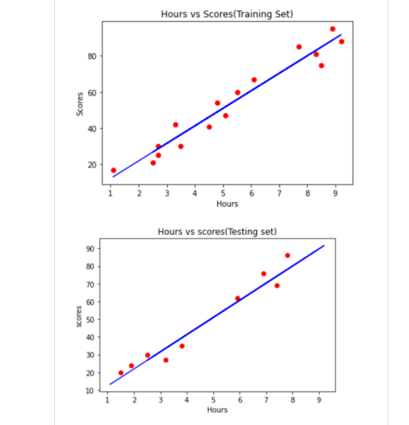

# Implementation-of-Simple-Linear-Regression-Model-for-Predicting-the-Marks-Scored

## AIM:
To write a program to implement the simple linear regression model for predicting the marks scored.

## Equipments Required:
1. Hardware – PCs
2. Anaconda – Python 3.7 Installation / Moodle-Code Runner

## Algorithm
1. Use the standard libraries in python.
2. Set variables for assigning dataset values.
3. Import LinearRegression from the sklearn.
4. Assign the points for representing the graph.
5. Predict the regression for marks by using the representation of graph.
6. Compare the graphs and hence we obtain the LinearRegression for the given datas. 

## Program:
```
/*
Program to implement the simple linear regression model for predicting the marks scored.
Developed by: Nivetha.M
RegisterNumber: 212221240034 
*/

import numpy as np
import pandas as pd
import matplotlib.pyplot as plt
df=pd.read_csv("/content/student_scores - student_scores.csv")
df.head()
x=df.iloc[:,:-1].values
x
y=df.iloc[:,1].values
y
from sklearn.model_selection import train_test_split
x_train,x_test,y_train,y_test=train_test_split(x,y,test_size=1/3,random_state=0)
from sklearn.linear_model import LinearRegression
regressor=LinearRegression()
regressor.fit(x_train,y_train)
y_pred=regressor.predict(x_test)
y_pred
y_test
plt.scatter(x_train,y_train,color="red")
plt.plot(x_train,regressor.predict(x_train),color="blue")
plt.title("Hours vs scores(Training set)")
plt.xlabel("Hours")
plt.ylabel("Scores")
plt.show()
plt.scatter(x_test,y_test,color="red")
plt.plot(x_train,regressor.predict(x_train),color="blue")
plt.title("Hours vs scores(Training set)")
plt.xlabel("Hours")
plt.ylabel("Scores")
plt.show()
```

## Output:




## Result:
Thus the program to implement the simple linear regression model for predicting the marks scored is written and verified using python programming.
